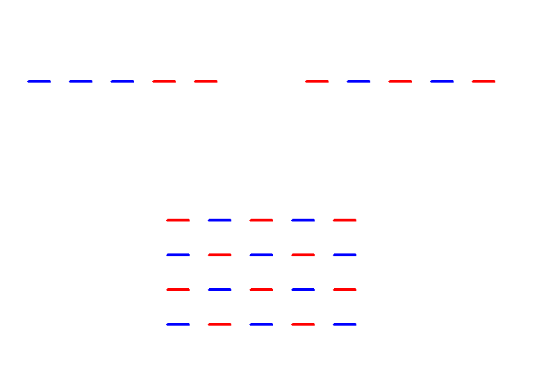

# Introducción a Python

## Semana 3
<!-- .element style="text-align:center" -->

 <!-- .element style="margin-left: auto; margin-right: auto; display: block" -->

---

# Enlaces:


- Tortuga: [https://pythonandturtle.com/turtle](https://pythonandturtle.com/turtle)
- Repl: [https://www.pythonmorsels.com/repl/](https://www.pythonmorsels.com/repl/)
- Presentaciones de las semanas anteriores:
  - [https://avast-python.github.io/semana-1](https://avast-python.github.io/semana-1)
  - [https://avast-python.github.io/semana-2](https://avast-python.github.io/semana-2)


---

### La programación son cinco cosas

1. ~~Secuencia~~ ✓
2. Condicionales <-
3. Repetición <-
4. Variables <-
5. Funciones

---

## Vuelta al `for`


```python
lado = 10
vueltas = 10
for num_vuelta in range(vueltas):
    t.forward(num_vuelta * lado)
    t.left(90)
```
<!-- .element style="font-size: 1em" -->

- Puedo usar variables para pintar
- Puedo acceder a `num_vuelta` dentro del bucle (no hace falta que se llame `num_vuelta`)
- Empieza en cero
- ¿Qué pintará esto?


--

# Ejercicio 1

```
lados = 4
largo_lado = 100

# Aquí tu código
```
<!-- .element style="font-size: 1em" -->

- Pinta un polígono de ese número de lados y con esa longitud
- Tiene que funcionar sin tener que modificar el programa aunque cambies las variables

 <!-- .element class="noborder center" -->

**Pista**: En un polígono regular todos los ángulos internos son iguales
y la suma es igual a 180° × (lados – 2).


**Extra**: Haz que en la base vaya un vértice, no una arista

---

# Ejercicio 2

 <!-- .element class="noborder center" -->

#### Extra: <!-- .element style="text-align:center" -->

 <!-- .element class="noborder center" -->


---

# Bucles múltiples

```python
for vuelta_exterior in range(5):

    t.pendown()

    for vuelta_interior in range(4):
        t.forward(100)
        t.left(90)

    t.penup()
    t.left(30)
```
<!-- .element style="font-size: 1em" -->

- Se pueden usar bucles dentro de bucles
- Dentro de un bucle, lo que hay una secuencia de instrucciones
- Esa secuencia puede, a su vez, ser un bucle

---

# Ejercicio 3

 <!-- .element class="noborder center" -->

**Extra**: ¿Puedes hacerlos utilizando variables para el largo de la línea, distancia entre líneas, lado del cuadrado largo...?

---

# Booleanos

- Es otro tipo de datos fundamental (además de "números" y cadenas )
- Dos valores: `True` / `False` (o verdad / mentira, cero/uno)
- Operadores para conseguir booleanos:
  - `True` y `False`
  - Igual: `==` ¡¡¡OJO!!! ¡¡NO ES UN SOLO `=`!!
  - Distinto: `!=`
  - Mayor, mayor o igual: `>`, `>=`
  - Menor, menor o igual: `<`, `<=`
- Los usaremos para comparar números y cadenas, pero ojo con comparar cadenas

<br>

- **OJO**: Cuidado cuando comparéis números con decimales: ¿`0.1 + 0.2 == 0.3`?
- **OJO**: Se pueden encadenar, pero no os lo recomiendo: `1 < 2 < 3`
- Los comparadores en Python son más complejos, pero ya hablaremos más de ellos

---

# Condicionales

```python
if ALGO_BOOLEANO:
    secuencia_instrucciones_1
elif OTRA_CONDICION:
    secuencia_instrucciones_2
elif OTRA_CONDICION_MAS:
    secuencia_instrucciones_3
else:
    secuencia_instrucciones_4
```
<!-- .element style="font-size: 1em" -->

- Sirven para "bifurcar" el código
- El `elif` y el `else` son opcionales

---

# Ejemplo de condicionales

```python
if numero % 2 == 0:
    print('El número es par')
```
<!-- .element style="font-size: 1em" -->

¿Qué imprimirá cuando numero vale 6?

¿Y cuando vale 5?
---

# Otro ejemplo de condicionales

```python
if numero > 10:
    print('El número es grande')
elif numero > 100:
    print('El número es muy grande')
else:
    print('El número es una caca')
```
<!-- .element style="font-size: 1em" -->

¿Qué imprimirá con los siguientes números?
- 10
- 101
- 34

---

# Ejercicio 4

 <!-- .element class="noborder center" -->

**Extra**: Haz el dibujo que tiene varias líneas
